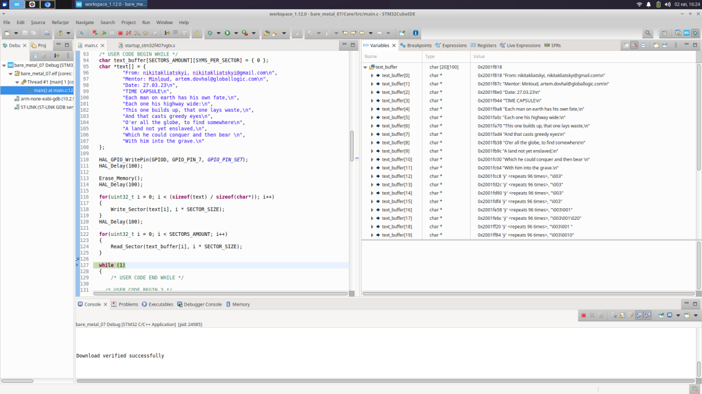

# Bare Metal Training 07: SPI Flash

## Assignment
1. Need to open and rewrite “Time Capsule” based on 16 Mbit SPI Serial Flash memory (SPI Clock Frequency is 500kBit/s).
2. Read time capsule content and save it to the text file. If it is empty – inform your mentor about it.
3. Send email message to person who create it (with content attached). Put current mentor and previous person mentor as CC. “We found your time capsule…”.
4. Erase time capsule (all memory).
5. Write your own time capsule. Send a message with the contest to your current mentor.
Read it back from the memory to check that everything is fine (after the power cycle off/on).
6. Time capsule message
“From: @USERNAME, @EMAIL”
“Mentor: @USERNAME, @EMAIL”
“Date: @DATE”
“TIME CAPSULE”
Poetry / Lyrics here, favorite song, etc. (8 – 16 lines). See sample below.
7. Each line should be written to the start of new 4kB block of memory.
Each line should end with CR (\n = #13) symbol.
So 20 lines – 20 memory blocks used (from the beginning of memory).
   
## [Solution](Core/)
Used Flash consists of 4 KByte sectors. 

*Set_SPI_Status* is used to manipulate CE and set it to high and low. Every SPI transition session beginss with this function and finishes with it to enable/disable CE.
*Set_Instruction* is used to initialize buffer, which data will be transmitted.
*Transmit*, *Receive* and *Transmit_Receive* are used for sending and getting data with SPI.

Read instruction cycles through the data reading it starting from the specified address and stops with a low to high transition on CE. It's used in a function *Read_Sector* to read 100 bytes starting from the specified adress, and then moves the data it's read into the array, that user has passed(from 4th position, because 0-3 == 0xFF). In main it's put into a cycle to read data from the address i * 4096, where i is in [0, 19] (because there are 20 sectors allocated), to read from the start of all 20 4kB blocks of memory.

Following image shows reading sequence: 

Write and Erase instructions need write protection to be turned off and write-enable instruction to be executed to work correctly. Functions *Set_Write_Register* and *Set_Write_Status* do this execute all needed instructions to do that. They're also used to achieve the opposite effect and disable write and turn on write protection. That's why, besides enabling/disabling CE, functions to erase chip and program data begin with *Set_Write_Register(ENABLED)* and *Set_Write_Status(ENABLED)* and finish with *Set_Write_Register(DISABLED)* and *Set_Write_Status(DISABLED)*.
To enable/disable writing, it's enough to execute WREN/WRDI device instructions respectively. *Set_Write_Status* does this.
To disable or enable write protection, it's needed to manipulate Status Register bits 2-5. Each bit is responsible for protecting it's own chunk of memory. Writing 0x00 to this register disables write protection, 0x1C - enables it (returns it to default state). It's needed to execute WRSR instruction and pass needed value there. Also, there is need in executing EWSR instruction first to enable changing this register value. Doing this is *Set_Write_Register* function's responsibility.

Following image shows sequence of actions, needed to allow writing: 

*Erase_Memory* function, after executing previously described needed for writing functions and setting CE to low, executes instruction, responsible for erasing whole chip.

Following image shows chip erasing sequence: 

*Write_Sector* programs data from a specified address using Auto Address Increment Programming with software End-Of-Write detection. It cycles through the passed string, writing 2 characters in one iteration into the memory. After writing session finishes (meaning write-disable instruction is executed and write protection is enabled), status register is read with RDSR instruction. It's zero bit is responsible for informing if there is any Internal Write operation in progress. And it waits while this bit equals 1. The same as reading, it's set to cycle through an array of strings and write each on into i * 4096, where i is in [0, strings_amount], to write them into the start of new 4kB block of memory.

Following image shows implemented writing sequence: 

All these function are defined [here](Core/Src/spi_flash.c).
Only three functions can be found in use in main faunction, located in [this file](Core/Src/main.c): Erase_Memory, Write_Section, Read_Section.
Repository stores the code as it was created, tested, used (with previously mentioned 3 functions), but at the end the board was programmed to only read memory contents(mostly for checking, if it's saved), and previously described program wasn't executed anymore, so, when the next student will turn the power of the board on, it's content was saved, and not erased or not fully written, so it was possible to read saved memory.

Before erasing and rewriting all the memory from the chip, it was empty. It can be seen on this screenshot:

After executing code from the repo, chip was rewritten and read into the buffer. Result is shown on the following screenshot:

And, after turning on and off the board, SPI memory was checked, and, as it can be seen from the following picture, written data was saved:

## Additional Materials
Capture of the signal trace of the program in execution and video of it's work can be found here:
[Google Drive Folder With Additional Materials](https://drive.google.com/drive/folders/1bfuC0hg8dh-z5F1fcq6eww9zFhJMqi1H?usp=share_link)
