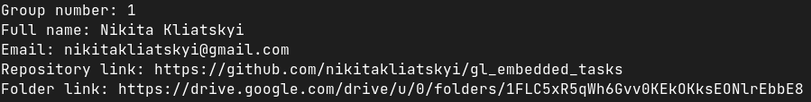

# Pure C Training 01: Prerequisites

## Assignment
1. Create “Hello World” application.
2. Application should print your info on the screen:
   - Group number;
   - Full name;
   - Email;
   - Repository link;
   - Shared folder link.
   
## [Solution](hello_world.c)
Following variables save data to print:
```c
int grp_num = 1;
const char *full_name = "Nikita Kliatskyi";
const char *email = "nikitakliatskyi@gmail.com";
const char *repo_link =
    "https://github.com/nikitakliatskyi/gl_embedded_tasks";
const char *folder_link = "https://drive.google.com/drive/u/0/folders/"
```
Following code prints data, saved in the previously shown variables:
```c
printf("Group number: %d\n"
       "Full name: %s\n"
       "Email: %s\n"
       "Repository link: %s\n"
       "Folder link: %s\n",
       grp_num, full_name, email, repo_link, folder_link);
```

## Additional Materials

[Google Drive Folder With Additional Materials](https://drive.google.com/drive/folders/1SrlqJSQuhzOhNr49mxPd0xnu69ddVhVk?usp=share_link)
