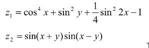
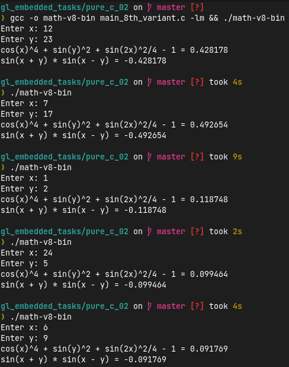

# Pure C Training 02: Basic calculations

## Assignment
1. Create application that calculate equation from the list below (according to your variant).
2. Variant number should be selected according to your number at the group (sorted by Second name / First name).


## [Solution](main_8th_variant.c)
User interface is implemented with following code:
```c
printf("Enter x: ");
scanf("%lf", &x);

printf("Enter y: ");
scanf("%lf", &y);
```
Function *equation1* calculates first equation:
```c
double equation_1(double x, double y) {
  return pow(cos(x), 4) + pow(sin(y), 2) + pow(sin(x * 2), 2) / 4 - 1;
}
```
Function *equation2* calculates second equation:
```c
double equation_2(double x, double y) { 
  return sin(x + y) * sin(x - y); 
}
```
Next lines print equations solutions:
```c
z1 = equation_1(x, y);
z2 = equation_2(x, y);

printf("cos(x)^4 + sin(y)^2 + sin(2x)^2/4 - 1 = %lf\n", z1);
printf("sin(x + y) * sin(x - y) = %lf\n", z2);
```

## Additional Materials

[Google Drive Folder With Additional Materials](https://drive.google.com/drive/folders/1GEbFZ1Bq5zHfxTTVcIxt6ecW6pCkitc2?usp=share_link)
