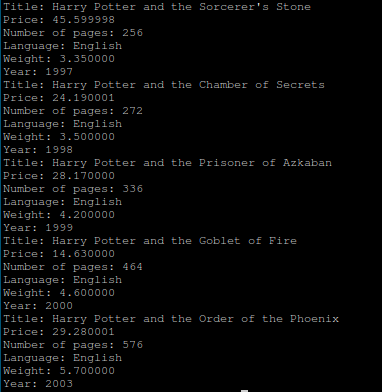

# Pure C Training 03: Linked list

## Assignment
1. Create a linked list that contain information about “Harry Potter” books series.
2. Each record should contain following fields:
   - Title
   - Price
   - Number of pages
   - Language
   - Weight
   - Year
3. Application should be able to print this information at the screen.
   
## Solution
Implemented types of linked list:
- [Singly Linked List](SinglyLinkedList)
- [Doubly Linked List](DoublyLinkedList)
- [Circular Singly Linked List](CircularSinglyLinkedList)
- [Circular Doubly Linked List](CircularDoublyLinkedList)

Each type has it's own header and source files, located in corresponding catalogs

### List Elements
List elements are objects of struct Node, which structure looks like this in the case of SinglyLinkedLists:
```c
typedef struct Node {
  struct Node *next;
  Book *book;
} Node;
```
And like this for DoublyLinkedLists:
```c
typedef struct Node {
  struct Node *next;
  struct Node *previous;
  Book *book;
} Node;
```
The main difference between each implementation of list are functions to print all nodes of the list and to link nodes.

Objects of struct Book are saved in each node:
```c
typedef struct Book {
  const char *title;
  float price;
  unsigned int pages_amount;
  Language language;
  float weight;
  unsigned int year;
} Book;
```
There are functions to initialize book object and to print book object data, which are the same for all implementation of linked list.
```c
void Book_Print(const Book *book) {
  printf("Title: %s\n"
         "Price: %f\n"
         "Number of pages: %d\n"
         "Language: %s\n"
         "Weight: %f\n"
         "Year: %d\n",
         book->title, book->price, book->pages_amount,
         Language_ToString(book->language), book->weight, book->year);
}

void Book_Init(Book *self, const char *title, float price,
               unsigned int pages_amount, Language language, float weight,
               unsigned int year) {
  self->title = title;
  self->price = price;
  self->pages_amount = pages_amount;
  self->language = language;
  self->weight = weight;
  self->year = year;
}
```
Following the given code, there is an enum, representing language the book is printed in. There is also a function to turn it into string.
```c
typedef enum {
  UKRAINIAN,
  ENGLISH,
  GERMAN,
  FRENCH,
  UNDEFINED_LANGUAGE
} Language;

const char *Language_ToString(Language language) {
  static const char *LanguagesNames[] = {"Ukrainian", "English", "German",
                                         "French", "Undefined"};
  return LanguagesNames[language];
}
```

### Singly Linked Lists
Implementation of linking nodes for SinglyLinkedList simply sets the next node of the *self*. If none other nodes are linked to a certain one, it becomes a tail of the list, because it's *next* parameter is NULL by default. After linking, the linked node becomes tail, or, if it already had other nodes linked, two lists are connected, and the tail of the second list becomes the tail of result.
```c
void Node_Link(Node *self, Node *other) { self->next = other; }
```
And PrintAll prints book of each node in the list, starting with the one, passed into the function. It continues it's execution until meets NULL, which works because parameter *next* for the tail of the list is NULL.
```c
void Node_PrintAll(const Node *node) {
  for (; node != NULL; node = node->next) {
    Book_Print(node->book);
  }
}
```

Usage example can be found [here](SinglyLinkedList/SinglyLinkedBookMain.c). After list initialization, nodes are linked. Here is an example of linking 5 nodes.
```c
  Node_Link(&node1, &node2);
  Node_Link(&node2, &node3);
  Node_Link(&node3, &node4);
  Node_Link(&node4, &node5);
```
And, to print this list, it's enough to pass an element to start from into PrintAll function.
```c
Node_PrintAll(&node1);
```

### Doubly Linked List
Implementation of linking nodes for DoublyLinkedList additionaly sets the *previous* value of the *other* to be equal *self*, so two nodes/lists are linked/connected in both sides.
```c
void Node_Link(Node *self, Node *other) {
  self->next = other;
  other->previous = self;
}
```
PrintAll works the same, but there is an ability to print books in another direction, which is used in the main as an example.
```c
Node *current_node = &node5;
for (; current_node != NULL; current_node = current_node->previous) {
  Book_Print(current_node->book);
}
```
In other aspects usage is going to be the same as in the case of singly linked list. Example can be found [here](DoublyLinkedList/DoublyLinkedBookMain.c).

### Circular Singly Linked Lists
Main difference between singly linked list and it's circular variant is linking operation, which additionaly needs to connect the end of the second list to the start of the first one. So, linking function iterates through the second list to get to it's tail and sets it's *next* value to *self*, so there is no tails anymore as every node has *next* initialized.
```c
void Node_Link(Node *self, Node *other) {
  Node *others_last_node = other;
  while (others_last_node->next != other && others_last_node->next != NULL) {
    others_last_node = others_last_node->next;
  }
  others_last_node->next = self;
  self->next = other;
}
```
In the case circular linked lists iterated the same as usual ones, they would be iterated over and over again. Even though this behaviour is their main advantage, we don't want function PrintAll to work infinitely. That's why it's implementation differs. It saves the head of the list (which is being passed as a parameter), and, as soon as it is being met again in the cycle, the cycle stops.
```c
void Node_PrintAll(const Node *node) {
  const Node *current_node = node;
  if (current_node == NULL) {
    return;
  }
  do {
    Book_Print(current_node->book);
    current_node = current_node->next;
  } while (current_node != node && current_node != NULL);
}
```
With this implementation of this two functions, usage looks the same as with common singly linked list. Still, it can be found [here](CircularSinglyLinkedList/CircularSinglyLinkedBookMain.c).

### Circular Doubly Linked Lists
Linking for doubly linked list connects 2 lists by appending tail (element before head) of the first list to the head (element after tail) of the first list, and vice versa.
```c
void Node_Link(Node *self, Node *other) {
  if (other->previous != NULL) {
    other->previous->next = self->next;
  }
  if (self->next != NULL) {
    self->next->previous = other->previous;
  }
  self->next = other;
  other->previous = self;
}
```
PrintAll is the same as for circular singly linked list, but it is possible to change the direction of the cycle. An example can be found [here](CircularDoublyLinkedList/CircularDoublyLinkedBook.c).
```c
Node *current_node = &node2;
do {
  Book_Print(current_node->book);
  current_node = current_node->previous;
} while (current_node != &node2 && current_node != NULL);
```

## Additional Materials
[Google Drive Folder With Additional Materials](https://drive.google.com/drive/folders/1ydIDowiMOQzbLxl-tD_yfvUDbcQlaGIb?usp=share_link)

