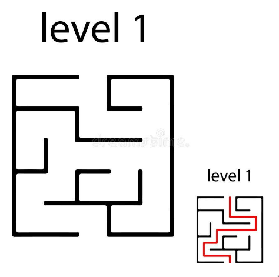
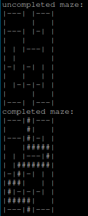

# Pure C Training 04: Maze (Labyrinth)

## Assignment
1. Create application that find exit from labyrinth.
2. Labyrinth could be represented like an array.
3. Use recursion to find an exit.
4. Solution could be graphical (pseudo graphical) or textual (like down, right, right,….).
   
## [Solution](maze_lib.c)
Maze is represented as two-dimensional array of char (with 11 rows and 11 columns in current implementation). Symbols '|' and '-' represent labyrinth's walls, and space - empty space, possible ways. Math solution is drawn with '#'.
So, with graphical representation of the maze looking like this:

It's represented in this program like this:


Printing maze is done with function, that just iterates through array, representing labyrinth, and prints every element.
There are also functions, needed to check if certain element is an empty space or math borders. They will be used in 
```c
#define EMPTY ' '

int is_empty(m_elem character) { return character == EMPTY; } // checks, if element is empty, and it's possible to use it as a step

// checks, if row or column in the current element is first or last in the labyrinth
int is_border(size_t current_row, size_t current_col, size_t rows_amount,
              size_t cols_amount) {
  return ((current_row == (rows_amount - 1)) || (current_row == 0) ||
          (current_col == (cols_amount - 1)) || (current_col == 0));
}
```

The function, responsible for solving the math, returns 0 (false) if it hasn't found solution and 1 (true) if it's solved it.
It's arguments are element, that is being checked, and information about labyrinth, that is being solved.
An element is checked only in the case it's empty. First thing it does is checking an element as already checked one by assigning it a value of '.', so it is not empty anymore and function won't be called for it.
After that it alternately recursively calls itself for every empty element from those, that are closest to the current. If this one element doesn't lead to the solution, it is set as checked. Only in the case one of this elements is a border or one of it's closest empty element leads to solution, the labyrinth is considered solved, and it has the value of '#' assigned to it. Than, the function ends, and returns to the function call, where it was called from. Depending on the result it returns, those calls get an understanding, if an element, that's being checked, leads to solution, or not.
In 
```c
#define STEP '#'
#define CHECKED '.'

int solve_maze(size_t rows_amount, size_t cols_amount,
               m_elem maze[rows_amount][cols_amount], size_t row, size_t col) {
  
  // if solution won't be found, it will be changed to checked
  maze[row][col] = STEP; // so this element won't be checked again
  
  // === the same thing will be called for (col + 1), (row - 1), (row + 1)
  if ((col - 1 >= 0) && is_empty(maze[row][col - 1])) { // if it's possible to step into [row][col - 1]
    if (is_border(row, col - 1, rows_amount, cols_amount)) { // and if it's a border (empty border == finish)
      maze[row][col - 1] = STEP; // then set it as a step to the solution
      return TRUE; // tell previously called functions, that math is solved
    } else if (solve_maze(rows_amount, cols_amount, maze, row, col - 1)) { // if [row][col - 1] is a step to the solution
      maze[row][col - 1] = STEP; // set it as a step
      return TRUE; // tell previously called functions, that math is solved
    }
    maze[row][col - 1] = CHECKED; // if it's not a finish and the way to the finish doesn't lie through it, then set it's value to check and continue checking other elements, closest to [row][col]
  }
  // ===

  // if no way to solution is found:
  maze[row][col] = CHECKED; 
  return FALSE;
}
```

Implemented function to solve a labyrinth changes it's content in the process, so it will store both solution and unsuccessful tries. We don't want to print unsuccessful tries, so we must clear the labyrinth of them. Two functions are used for that:
```c
// iterate through the maze and call the passed function for every element
void iterate_maze(size_t rows_amount, size_t cols_amount,
                  m_elem maze[rows_amount][cols_amount],
                  void (*function)(m_elem *)) {
  for (int i = 0; i < rows_amount; i++) {
    for (int j = 0; j < cols_amount; j++) {
      function(&maze[i][j]);
    }
  }
}

// to clear an element, checked as '.', this function is used
void clear_elem(m_elem *element) {
  if (*element == CHECKED) {
    *element = EMPTY;
  }
}
```
An example of usage can be found [here](main.c). To be brief, main part of example looks like this:
```c
print_maze(ROWS, COLS, maze);
solve_maze(ROWS, COLS, maze, MAZE_START_ROW, MAZE_START_COL);
iterate_maze(ROWS, COLS, maze, clear_elem);
print_maze(ROWS, COLS, maze);
```

## Additional Materials

[Google Drive Folder With Additional Materials](https://drive.google.com/drive/folders/1S_OR1QAltnGfACZpj4HkSNRZO1ld5_aY?usp=share_link)
